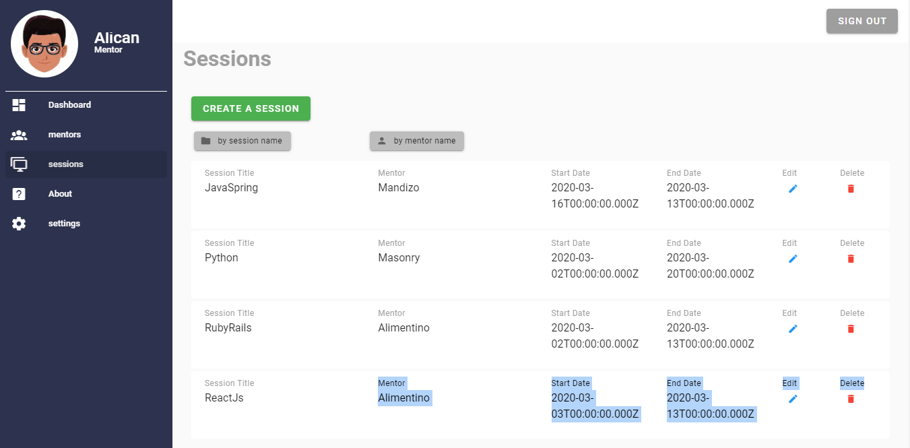

# mentorship-app

> This project consists of building of the Front-end of a mentorship Application that is used for e-learning. 



## Built With

- Vue.Js,
- Vuetify and CSS


## Getting Started

To get a local copy up and running follow these simple example steps.

### Prerequisites

#### You should have installed git on your local machine and a text editor preferably VS Code.

### Setup

#### Clone the repository into your local machine.

## Project setup
```
npm install
```

### Compiles and hot-reloads for development
```
npm run serve
```

## Author

👤 **Author1**

- Github: [@OdongAlican](https://github.com/OdongAlican)
- Twitter: [@odongsandie](https://twitter.com/odongsandie)
- Linkedin: [Sunday Alican odong](https://www.linkedin.com/in/sunday-alican-odong-b99226b7)

## 🤝 Contributing

Contributions, issues and feature requests are welcome!

Feel free to check the [issues page](issues/).

## Show your support

Give a ⭐️ if you like this project!

## Acknowledgments

- Appreciation to my coding Partner and mentor

## 📝 License

This project is [MIT](lic.url) licensed.


### Customize configuration
See [Configuration Reference](https://cli.vuejs.org/config/).